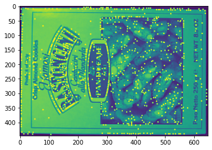

# SIFT描述子算法（不完整）

#代码log

## 3.9任务：
1.特征点个数过多，需要做筛除。目前有584323个。

2.灰度图像的图像存储形式是以01还是0 255。这关系到阈值的设立。这里猜想是0 255

3.主要问题是在查看高斯差分金字塔的时候发现内部数字的格式是uint8，所以无法看到小数点后几位，对之后的领域比较和阈值筛除不利，需要进一步处理

**以上问题已解决：在开头读取图片后利用astype('float32')函数将默认uint8转换为float32，特征点个数从60000个变为900个**

## 3.10任务：
1.去除噪声点(从下图可以看出噪声严重，应该是拍摄设备是胶卷相机或者夜晚过黑的问题，需要调大阈值）

2.如何确定高斯差分金字塔的尺度

**已解决，询问老师后得到高斯差分公式 3.11**

## 3.10进度：
目前已经能初步提取特征点：

## 3.11进度
1. 加入边缘检测，去掉边缘特征点。（特征点个数从936个到515个）

2. 极值点更新进度到求偏移量，后续需要加入根据偏移量的重新确定新的极值点，循环五次后看是否能使3个方向的偏移都小于0.5，如果不能则舍弃。

## 3.12进度
1.完成极值点更新部分，目前特征点数到414(后再加阈值，变为377），下一步是构建特征点描述子

**效果不是很好，不如没加极值点更新方法的效果，在空白部分多出一些特征点**

**初步怀疑是插值精度的问题，也有可能是极值点更新算法的问题。**

**已解决，是坐标转换到图片上的展示问题**

## 3.15进度：
1. 计算极值点方向，目前直方图可以计算出来，主要是如何确定主方向和副方向（似乎需要在直方图的基础上平滑）
2. 具有多个方向的极值点只占所有极值点的0.33，比论文中的15%高，故计算方式可能出有问题。

（决定使用高斯平滑加二次插值确定具体方向）

**原来是忘记添加峰值判断了,平滑前后比例变化不大,都是17%,平滑后点个数会少一些**
成功计算出443个特征点的方向，之后的任务是给出每个特征点的描述子。

## 3.18进度
1. 完成描述子的算法，同时实现最后的图像匹配展示。效果不尽人意。

2. 怀疑是计算特征点描述子的问题，因为采用float的精度，有时候一些精度会丢失。
3. 此外由于时间不足没有使用RANSAC算法，采用余弦相似度或者L2距离同时设置阈值，但匹配效果不好。

## 3.20进度
1. 使用cv2的FLANN，匹配点明显减少，但匹配效果仍然不佳，根据前面的log发现sigma计算基本没有问题，估计是在特征点检测后出现问题。
2. 由于作业时间问题，不再对算法进行debug

